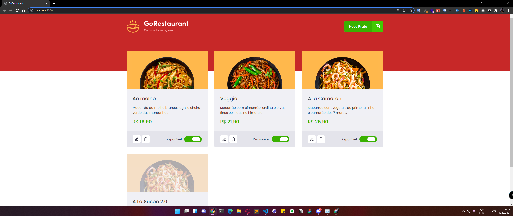

# Desafio 02 Ignite refatorando projeto reactjs para reactjs com TypeScript | Trilha Reactjs

Desafio Chapter 02 do curso Ignite da Rocketseat | Trilha de Reactjs

<h2>Como Iniciar o projeto? 🎲 </h2>

```bash

# Clone este repositório
$ git clone https://github.com/Diego-Lopes/desafio_02_Chapter_02_Refactoring_Classes-ts.git

# Acesse a pasta do projeto no seu terminal/cmd
$ cd desafio_02_Chapter_02_Refactoring_Classes-ts

# Instale as dependências
$ yarn

# Inicie o servidor
$ yarn server

# Inicie o projeto
$ yarn start

```



<hr />
<p align=center>Refactored with 💜 by <a href="https://www.linkedin.com/in/diego-lopes-37877a105/">Diego da Silva Lopes</a><p>
